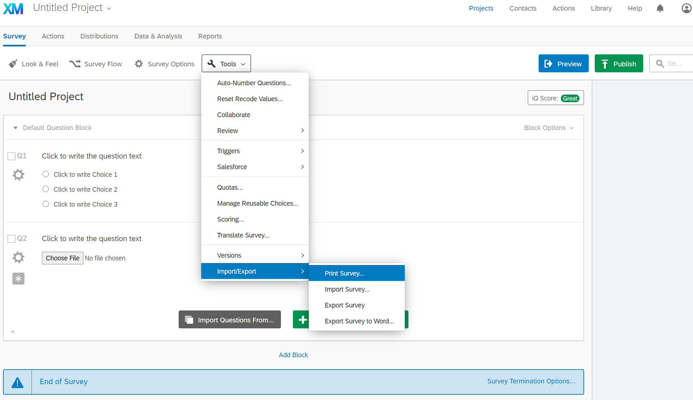
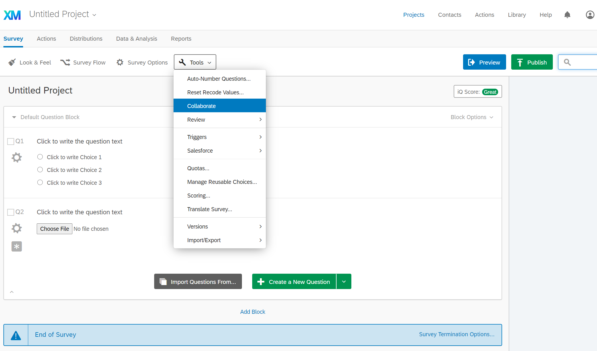

# Using [Qualtrics](https://berkeley.ca1.qualtrics.com/) for Surveys

As a UC Berkeley student, you have access to all Qualtrics features for free through the university site license at
[https://berkeley.ca1.qualtrics.com/](https://berkeley.ca1.qualtrics.com/).

When you're ready for your instructors to review your survey, you should print the survey design and either update your study documents to include/link to the printout.

To allow instructors or others to make changes to your survey or view the results as they come in, make them collaborators.

